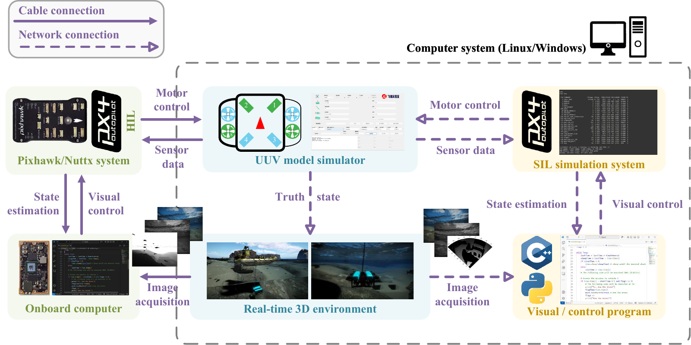
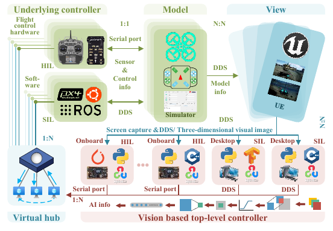
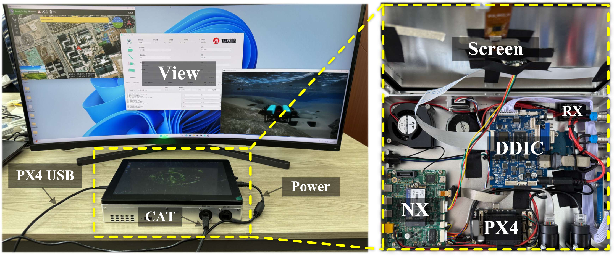
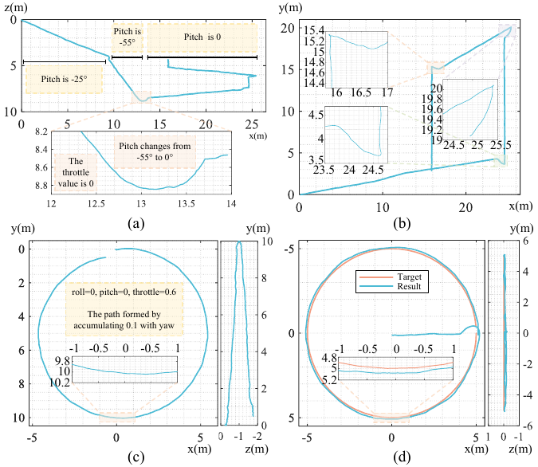

# UnderWaterPlatform

本文开源仓库对应论文：

**A Physics-Based Simulation Framework for Underwater Vehicle Dynamics and Multi-Sensor Perception**

仓库中整理了 UUV 动力学仿真文件、SIL/HIL 启动脚本、传感器配置、VINS-Fusion 配置、融合定位代码、控制示例以及部分实验日志，用于支撑论文修订稿中的开源与可复现实验说明。

- 项目视频：[Bilibili demo](https://www.bilibili.com/video/BV1h8q5BSEo7/)
- 公开仓库：[https://github.com/RflySim/UnderWaterPlatform.git](https://github.com/RflySim/UnderWaterPlatform.git)
- 平台文档：[https://www.rflysim.com](https://www.rflysim.com)

## 效果预览

下列图片概括了本仓库发布的 SIL/HIL 工作流、分布式仿真接口、实验环境和典型运动行为验证结果。

<p align="center">
  
</p>

<p align="center">
  
  
</p>

<p align="center">
  
</p>

## 仓库内容

| 路径 | 内容 | 用途 |
|---|---|---|
| `UUV/` | UUV 动力学 DLL、PX4/Pixhawk 参数与固件、相机配置、SIL/HIL 启动脚本 | 启动 RflySim 兼容的 UUV 软件在环和硬件在环仿真 |
| `Demo/` | 姿态/路径控制和相机取图示例 | 提供最小化控制与感知数据访问示例 |
| `FusionLocation/` | ROS 侧融合定位代码、缆索相对定位、VINS 重定位接口、Kalman 滤波融合代码 | 复现视觉惯性与缆索相对定位融合流程 |
| `euroc_uuv/` | 相机与 VINS-Fusion YAML 配置 | 配置仿真 UUV 的单目/双目图像和 IMU 数据流 |
| `Data/` | SIL/HIL 与定位实验 CSV 日志 | 支持轨迹、姿态、速度、IMU、GPS 兼容输出和融合结果的离线检查 |
| `docs/` | 复现、配置和数据说明 | 说明仓库内容与论文实验、审稿人关注点之间的对应关系 |
| `media/` | 从论文图中导出的 README 预览图 | 快速展示平台工作流和验证内容 |

## 主要功能

- 通过 `UUVModel.dll` 运行 RflySim 兼容 UUV 动力学模型。
- 支持 UE4 和 UE5 工作流下的软件在环（SIL）与硬件在环（HIL）启动。
- 面向 PX4/Pixhawk 硬件在环实验提供参数与固件文件。
- 通过 `Config.json` 配置 RGB、灰度图和深度图等视觉传感器输出。
- 提供 VINS-Fusion 所需的双目相机和 IMU 接口配置。
- 提供 VINS 重定位、缆索/相对定位和 Kalman 滤波路径融合流程。
- 提供 SIL/HIL 对比和定位实验的部分 CSV 日志。

## 论文实验环境

论文实验使用的主要环境如下：

- RflySim v4.12，包含 CopterSim、QGroundControl、PX4/Pixhawk 支持和 RflySimUE5。
- Unreal Engine 5.2 cooked assets。
- MATLAB/Simulink R2024b，用于模型开发和代码生成。
- Python 3.12，用于发布的 Python 侧工作流。
- ROS 和 VINS-Fusion，用于融合定位实验。
- Windows 11 工作站，Intel Core i7-11700F CPU，16 GB RAM，NVIDIA GeForce RTX 3070 GPU（8 GB VRAM）。

仓库不包含 RflySim、PX4、QGroundControl、ROS、VINS-Fusion 等第三方平台本体。请从对应官方来源安装，并遵守其许可条款。

## 快速启动：SIL

1. 在 Windows 主机上安装并配置 RflySim。
2. 以管理员权限打开终端。
3. 运行下列 SIL 启动脚本之一：

```bat
UUV\UUVModel_SITL.bat
UUV\UUVModel_SITLUE5.bat
```

4. 按提示输入 `1` 创建航行器实例。
5. CopterSim、QGroundControl 和三维渲染环境启动后，运行示例程序：

```bat
python Demo\UUVAttCtrlPath.py
python Demo\UUVAttCtrlCamera.py
```

## 快速启动：HIL

1. 将 `UUV/px4_fmu-v6c_default.px4` 烧录到对应 PX4/Pixhawk 硬件，或者根据目标硬件使用 PX4/RflySim 流程自行编译固件。
2. 使用 USB 将飞控连接到 Windows 仿真主机。
3. 以管理员权限打开终端。
4. 运行下列 HIL 启动脚本之一：

```bat
UUV\UUVModel_HITL.bat
UUV\UUVModel_HITLUE5.bat
```

5. 按脚本提示输入对应 COM 端口号。
6. 仿真环境启动完成后，运行控制示例或融合定位流程。

## 融合定位流程

融合定位流程使用 RflySim 图像/IMU 数据流、VINS-Fusion、缆索相对定位信息和 Kalman 滤波路径融合。

1. 准备 ROS 和 VINS-Fusion 环境。
2. 将 `FusionLocation/` 复制到 ROS 侧工作空间或虚拟机。
3. 将 RflySim SDK Python 接口复制到同一环境，并在平台更新后重新刷新 SDK 路径。
4. 将 `euroc_uuv/` 中的 YAML 文件复制到 VINS-Fusion 配置目录。
5. 使用 UE5 SIL 或 HIL 脚本启动仿真平台。
6. 运行：

```bash
cd FusionLocation
bash oneKeyScript.sh
```

分层复现流程见 [docs/REPRODUCIBILITY.md](docs/REPRODUCIBILITY.md)。

## 传感器配置

主要相机配置文件为：

- `UUV/Config.json`：仿真侧视觉传感器配置。
- `FusionLocation/Config.json`：融合定位取图侧配置。

`TypeID` 字段用于选择视觉输出类型：

| `TypeID` | 输出 |
|---:|---|
| `1` | RGB 图像 |
| `2` | 灰度图 |
| `3` | 深度图 |

其他关键字段包括图像分辨率、采样频率、相机视场角、UDP 端口、传感器安装位置和姿态。详情见 [docs/CONFIGURATION.md](docs/CONFIGURATION.md)。

## 数据日志

`Data/` 目录包含部分实验 CSV 日志：

- `Data/sil_hil/sil/` 和 `Data/sil_hil/hil/`：SIL/HIL 配对系统日志。
- `Data/location1/`、`Data/location2/`、`Data/location3/`：定位实验输出。
- `Data/Data/`：为兼容早期脚本保留的 SIL/HIL 数据副本。

文件命名和列含义说明见 [docs/DATASETS.md](docs/DATASETS.md)。

## 可复现性清单

本仓库包含：

- UUV 动力学二进制文件：`UUV/UUVModel.dll`。
- PX4/Pixhawk 参数和固件：`UUV/UUV.params`、`UUV/px4_fmu-v6c_default.px4`。
- UE4/UE5 的 SIL/HIL 启动脚本。
- 相机和传感器数据流配置。
- VINS-Fusion 相机/IMU YAML 配置。
- 控制、取图、重定位、缆索定位和融合定位脚本。
- SIL/HIL 和定位实验 CSV 日志。
- 与论文实验对应的复现说明文档。

论文中用于真实 UUV 短时域回放验证的 SOLAQUA 数据集是外部公开数据集，已在论文中引用，本仓库不镜像该第三方数据集。

## 引用

如果该仓库对你的研究有帮助，请引用对应论文：

```text
X. Dai, Y. Yang, and Y. Chen, "A Physics-Based Simulation Framework for Underwater Vehicle Dynamics and Multi-Sensor Perception," submitted.
```

仓库中提供了 `CITATION.cff` 引用占位文件，论文正式出版后应更新出版信息。

## 许可

本仓库发布的源代码、配置文件、说明文档和示例文件采用 MIT License。RflySim、PX4、QGroundControl、ROS、VINS-Fusion、MATLAB/Simulink 和 Unreal Engine 资源等第三方平台与工具仍遵循其各自许可条款。

## 注意事项

- Windows 启动脚本需要以管理员权限运行。
- `UUVModel.dll` 应与启动脚本放在同一目录。
- Python 脚本依赖 RflySim Python API，例如 `PX4MavCtrlV4`、`UE4CtrlAPI`、`VisionCaptureApi` 和 `ReqCopterSim`。
- ROS 消息包和 VINS-Fusion 需要单独安装，不属于 Python `pip` 依赖。
